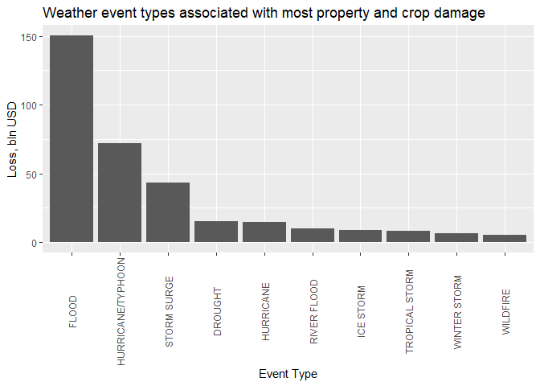

## Synopsys

This project involves exploring the U.S. National Oceanic and Atmospheric Administration's (NOAA) storm database and aims at exploring the correlation between event types and the magnitude of health and economic impact they bear. Tornados were identified as most dangerous to population, whereas floods have the most devastating economic consequences.

## Loading and Processing the Raw Data

The data for this project comes from the U.S. National Oceanic and Atmospheric Administration's (NOAA) storm database.

There is also some documentation of the database available.

* [National Weather Service Storm Data Documentation](https://d396qusza40orc.cloudfront.net/repdata%2Fpeer2_doc%2Fpd01016005curr.pdf)
* [National Climatic Data Center Storm Events FAQ](https://d396qusza40orc.cloudfront.net/repdata%2Fpeer2_doc%2FNCDC%20Storm%20Events-FAQ%20Page.pdf)


```r
library(plyr)
library(dplyr)
download.file("https://d396qusza40orc.cloudfront.net/repdata%2Fdata%2FStormData.csv.bz2", "storms.bz2")
storms <- tbl_df(read.csv("storms.bz2"))
```

First, let's look at the data


```r
head(storms)
```

```
##   STATE__           BGN_DATE BGN_TIME TIME_ZONE COUNTY COUNTYNAME STATE
## 1       1  4/18/1950 0:00:00     0130       CST     97     MOBILE    AL
## 2       1  4/18/1950 0:00:00     0145       CST      3    BALDWIN    AL
## 3       1  2/20/1951 0:00:00     1600       CST     57    FAYETTE    AL
## 4       1   6/8/1951 0:00:00     0900       CST     89    MADISON    AL
## 5       1 11/15/1951 0:00:00     1500       CST     43    CULLMAN    AL
## 6       1 11/15/1951 0:00:00     2000       CST     77 LAUDERDALE    AL
##    EVTYPE BGN_RANGE BGN_AZI BGN_LOCATI END_DATE END_TIME COUNTY_END
## 1 TORNADO         0                                               0
## 2 TORNADO         0                                               0
## 3 TORNADO         0                                               0
## 4 TORNADO         0                                               0
## 5 TORNADO         0                                               0
## 6 TORNADO         0                                               0
##   COUNTYENDN END_RANGE END_AZI END_LOCATI LENGTH WIDTH F MAG FATALITIES
## 1         NA         0                      14.0   100 3   0          0
## 2         NA         0                       2.0   150 2   0          0
## 3         NA         0                       0.1   123 2   0          0
## 4         NA         0                       0.0   100 2   0          0
## 5         NA         0                       0.0   150 2   0          0
## 6         NA         0                       1.5   177 2   0          0
##   INJURIES PROPDMG PROPDMGEXP CROPDMG CROPDMGEXP WFO STATEOFFIC ZONENAMES
## 1       15    25.0          K       0                                    
## 2        0     2.5          K       0                                    
## 3        2    25.0          K       0                                    
## 4        2     2.5          K       0                                    
## 5        2     2.5          K       0                                    
## 6        6     2.5          K       0                                    
##   LATITUDE LONGITUDE LATITUDE_E LONGITUDE_ REMARKS REFNUM
## 1     3040      8812       3051       8806              1
## 2     3042      8755          0          0              2
## 3     3340      8742          0          0              3
## 4     3458      8626          0          0              4
## 5     3412      8642          0          0              5
## 6     3450      8748          0          0              6
```

Formatting the column names


```r
names(storms)<- tolower(make.names(names(storms), unique = T, allow_ = F))
```


### Population damage by event type

The columns we are interested in are "fatalities" and "injuries". The storm database contain only *direct* injuries, in other words the ones that can be directly attributed to the observed weather event. Let's look at the summary of those columns and see if there's any missing data.


```r
summary(storms$fatalities)
```

```
##     Min.  1st Qu.   Median     Mean  3rd Qu.     Max. 
##   0.0000   0.0000   0.0000   0.0168   0.0000 583.0000
```


```r
summary(storms$injuries)
```

```
##      Min.   1st Qu.    Median      Mean   3rd Qu.      Max. 
##    0.0000    0.0000    0.0000    0.1557    0.0000 1700.0000
```

### Economic damage by event type

The most interesting columns here would be "propdmg" and "cropdmg" with their value magnitutes in "propdmgexp" and "cropdmgexp" respectively.

Let's take a look at the property data first


```r
summary(storms$propdmg)
```

```
##    Min. 1st Qu.  Median    Mean 3rd Qu.    Max. 
##    0.00    0.00    0.00   12.06    0.50 5000.00
```


```r
summary(storms$propdmgexp)
```

```
##             -      ?      +      0      1      2      3      4      5 
## 465934      1      8      5    216     25     13      4      4     28 
##      6      7      8      B      h      H      K      m      M 
##      4      5      1     40      1      6 424665      7  11330
```

Unfortunately we can see that not all the numbers are properly formatted as per NWS storm data documentation. In particular, letters "K", "M" and "B" mean 10^3, 10^6 and 10^9 magnifyers respectively, and we can assume that "H/h" would mean hundreds. We can also assume that numbers directly signify magnitude, and "", "-", "0" mean magnitude of 1. Rest of the symbols remain mysterious and demand further investigation, but seeing that they account for relatively small amount of observations we would ignore them for this research and treat them as missing ones.


```r
storms <- storms %>%
        mutate(propdmg.m = with(., case_when(
        (propdmgexp == "h" | propdmgexp == "H")~2,
        (propdmgexp == "k" | propdmgexp == "K")~3,
        (propdmgexp == "m" | propdmgexp == "M")~6,
        (propdmgexp == "b" | propdmgexp == "B")~9,
        (propdmgexp %in% c("","0","-"))~1,
        (propdmgexp %in% as.character(1:9))~ as.numeric(as.character(propdmgexp)))))
##Calculate the final loss in USD
storms <- storms %>% mutate(propdmg.v = propdmg*10^propdmg.m)
```

We deal similarly with crops damage data


```r
storms <- storms %>%
        mutate(cropdmg.m = with(., case_when(
        (cropdmgexp == "h" | cropdmgexp == "H")~2,
        (cropdmgexp == "k" | cropdmgexp == "K")~3,
        (cropdmgexp == "m" | cropdmgexp == "M")~6,
        (cropdmgexp == "b" | cropdmgexp == "B")~9,
        (cropdmgexp %in% c("","0","-"))~1,
        (cropdmgexp %in% as.character(1:9))~ as.numeric(as.character(cropdmgexp)))))

storms<- storms %>% mutate(cropdmg.v = cropdmg*10^cropdmg.m)
```

## Results

### Health impact

For the health impact we will look at the top 10 event types that brought most fatalities and injuries to US throughout the history of observations. 


```r
storms.toph <- storms %>%
        group_by(evtype) %>%
        summarize(total = sum(fatalities,injuries)) %>%
        top_n(10) %>%
        arrange (desc(total))
storms.toph
```

```
## # A tibble: 10 x 2
##    evtype            total
##    <fct>             <dbl>
##  1 TORNADO           96979
##  2 EXCESSIVE HEAT     8428
##  3 TSTM WIND          7461
##  4 FLOOD              7259
##  5 LIGHTNING          6046
##  6 HEAT               3037
##  7 FLASH FLOOD        2755
##  8 ICE STORM          2064
##  9 THUNDERSTORM WIND  1621
## 10 WINTER STORM       1527
```
We can see that TORNADO was the most harmful type of event in the explored preiod.

### Economic impact

For the economic impact we are looking into amount of property and crop damage


```r
storms.econ <- storms %>%
        group_by(evtype) %>%
        summarize(totalprop = sum(propdmg.v), totalcrop = sum(cropdmg.v), total = sum(propdmg.v+cropdmg.v)) %>%
        top_n(10, wt = total) %>%
        arrange (desc(total))
```


```r
storms.econ
```

```
##               evtype    totalprop   totalcrop        total
## 1              FLOOD 144657709870  5661968450 150319678320
## 2  HURRICANE/TYPHOON  69305840000  2607872800  71913712800
## 3        STORM SURGE  43323536000        5000  43323541000
## 4            DROUGHT   1046106000 13972566000  15018672000
## 5          HURRICANE  11868319010  2741910000  14610229010
## 6        RIVER FLOOD   5118945500  5029459000  10148404500
## 7          ICE STORM   3944928310  5022113500   8967041810
## 8     TROPICAL STORM   7703890550   678346000   8382236550
## 9       WINTER STORM   6688497260    26944000   6715441260
## 10          WILDFIRE   4765114000   295472800   5060586800
```

We can see that for crop the most damaging event is DROUGHT

And for property  - FLOOD

However for total economic impact we are looking at overall costs


```r
library(ggplot2)
ggplot(data=storms.econ, aes(x=reorder(evtype, -total), y=total/1000000000)) + 
        geom_bar(stat="identity") + 
        labs(title="Weather event types associated with most property and crop damage", 
                y="Loss, bln USD", 
                x = "Event Type") + 
        theme(axis.text.x = element_text(angle = 90, vjust=0.5))
```

<!-- -->

### Environment data

```r
sessionInfo()
```

```
## R version 3.5.1 (2018-07-02)
## Platform: x86_64-w64-mingw32/x64 (64-bit)
## Running under: Windows 10 x64 (build 17134)
## 
## Matrix products: default
## 
## locale:
## [1] LC_COLLATE=English_United States.1252 
## [2] LC_CTYPE=English_United States.1252   
## [3] LC_MONETARY=English_United States.1252
## [4] LC_NUMERIC=C                          
## [5] LC_TIME=English_United States.1252    
## 
## attached base packages:
## [1] stats     graphics  grDevices utils     datasets  methods   base     
## 
## other attached packages:
## [1] ggplot2_3.1.0
## 
## loaded via a namespace (and not attached):
##  [1] Rcpp_0.12.19     bindr_0.1.1      knitr_1.20       magrittr_1.5    
##  [5] tidyselect_0.2.5 munsell_0.5.0    colorspace_1.3-2 R6_2.3.0        
##  [9] rlang_0.3.0.1    stringr_1.3.1    plyr_1.8.4       dplyr_0.7.8     
## [13] tools_3.5.1      grid_3.5.1       gtable_0.2.0     withr_2.1.2     
## [17] htmltools_0.3.6  assertthat_0.2.0 yaml_2.2.0       lazyeval_0.2.1  
## [21] rprojroot_1.3-2  digest_0.6.18    tibble_1.4.2     crayon_1.3.4    
## [25] bindrcpp_0.2.2   purrr_0.2.5      glue_1.3.0       evaluate_0.12   
## [29] rmarkdown_1.10   labeling_0.3     stringi_1.2.4    compiler_3.5.1  
## [33] pillar_1.3.0     scales_1.0.0     backports_1.1.2  pkgconfig_2.0.2
```

The full data for this research is available at [GitHub](https://github.com/lenin-grib/weather-events-impact)

